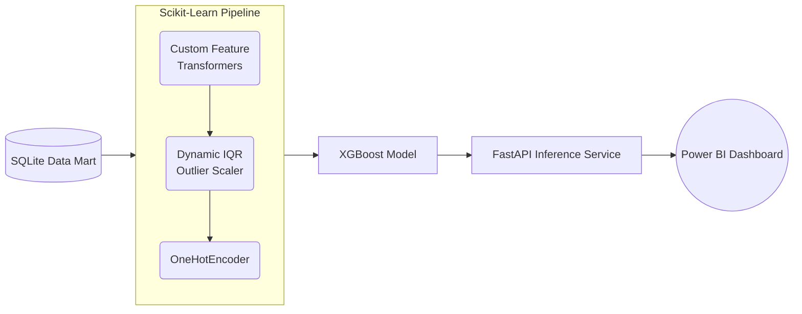

# Churn Revenue System


## 1. Executive Summary

The **Churn Revenue System** is a robust, production-grade machine learning platform designed to identify at-risk customers and explain the precise drivers behind their churn probability. 

Its core value proposition lies in bridging the gap between advanced ML models and actionable business intelligence:
- **Real-Time Prediction:** A highly concurrent FastAPI microservice delivering instant churn probability scoring.
- **Explainable AI (XAI):** Mathematically sound, local feature attributions using SHAP (`shap.TreeExplainer`) so business users know *why* a customer is leaving.
- **Dynamic Threshold Tuning:** Optimized decision boundaries tailored to dataset class imbalances for maximum F1-score performance.
- **Robust Pipeline Integrity:** Unifying data imputation, feature derivation, and one-hot encoding into a single serialized Scikit-Learn `Pipeline` to absolutely eliminate train-serve data drift.

---

## 2. System Architecture & Data Pipeline

To prevent train-serve data drift, all preprocessing logic (including dynamic outlier bound calculation) is strictly embedded within the `Pipeline.fit()` phase on the training data. The production API serves this identical, serialized pipeline, ensuring incoming JSON payloads are transformed exactly like the training matrices.



---

## 3. Feature Engineering & Mathematical Formulations

The system engineers several behavioral proxy features designed to capture customer financial tension and engagement drop-offs.

### Financial Proxies
- **Charge-to-Tenure Ratio:** Measures the intensity of billing relative to the length of the customer relationship.
  $$ \text{ChargeToTenure} = \frac{\text{MonthlyCharges}}{\text{tenure} + 1} $$
  
- **Lifetime Discrepancy Ratio:** Identifies irregular billing jumps compared to expected lifetime spend.
  $$ \text{LifetimeDiscrepancy} = \frac{\text{TotalCharges}}{(\text{tenure} \times \text{MonthlyCharges}) + 1} $$

### Outlier Handling
- **Interquartile Range (IQR) Bounds:** Outlier boundaries for financial metrics are learned dynamically exclusively during the pipeline `fit` phase.
  $$ \text{Upper Bound} = Q_3 + 1.5 \times \text{IQR} $$

### F1-Optimal Probability Thresholding
Relying on the default $0.5$ classification threshold in imbalanced datasets (like Telco Churn at ~26% positive class) severely penalizes Recall. Our pipeline calculates the optimal decision boundary $\tau^*$ via the Precision-Recall curve to maximize the harmonic mean (F1-Score):
$$ \tau^* = \arg\max_\tau \left( 2 \cdot \frac{\text{Precision}(\tau) \cdot \text{Recall}(\tau)}{\text{Precision}(\tau) + \text{Recall}(\tau)} \right) $$

---

## 4. Model Architecture, Evaluation & Explainability

During the training phase, the pipeline evaluates Logistic Regression and Random Forest as baselines before executing a Grid Search over an **XGBoost Classifier**. 

**Key Performance Metrics (Test Set)**
- **ROC-AUC:** ~0.84
- **Recall:** ~0.69
- **F1-Score:** ~0.62

### Explainability with SHAP
Because multiplying global feature importances by local feature values is mathematically unsound for tree-based ensembles, the FastAPI endpoint integrates `shap.TreeExplainer`. By passing the transformed inputs (`pipeline[:-1].transform(df)`) into the explainer, the API computes accurate Shapley values to isolate the **Top 3 Drivers** pushing a specific customer towards churn.

---

## 5. Tech Stack & Tools

**Core Machine Learning**
- `Python 3.11`
- `XGBoost`
- `Scikit-Learn`
- `SHAP` (Shapley Additive exPlanations)
- `MLflow` (Experiment tracking)
- `Pandas` / `NumPy`

**API & Infrastructure**
- `FastAPI` + `Uvicorn`
- `Pydantic v2` + `pydantic-settings` (Environment configuration)
- `Pytest` (Test automation)
- `Docker` (Containerization)

**Data & Analytics**
- `SQLite3`
- `Power BI`

---

## 6. MLOps & Monitoring

To maintain observability over both the training pipeline and real-time serving, the repository incorporates built-in tracking and logging:

### Training Tracking (MLflow)
During `train_model.py` execution, the system dynamically checks for MLflow. If available, it automatically creates an experiment (`Churn_Prediction`), logs key classification metrics (Recall, F1-Score, ROC-AUC, Optimal Threshold), and saves the final `Pipeline` artifact. 
To view the training UI locally:
```bash
mlflow ui
```

### API Serving Logs
The FastAPI inference service in `main.py` utilizes Python's built-in `logging` module to stream predictions to `sys.stdout`. Every JSON payload request records its timestamp, prediction probability, risk tier, and latency. This makes the application deployment-ready for standard log aggregators (e.g., Render, Datadog) that parse standard output.

---

## 7. Directory Structure

```text
.
├── .env.example
├── .dockerignore
├── Dockerfile
├── requirements.txt
├── README.md
├── data/
│   ├── raw/                  # Source CSVs
│   └── processed/            # churn_db.sqlite
├── models/
│   └── xgboost_churn_pipeline.pkl
├── tests/
│   └── test_pipeline.py
├── dashboards/               # Power BI templates
└── src/
    ├── api/
    │   └── main.py           # FastAPI application
    ├── data/
    │   └── clean_data.py     # Base ETL to SQLite
    ├── features/
    │   └── transformers.py   # Custom Sklearn Transformers
    └── models/
        └── train_model.py    # Pipeline construction & fitting
```

---

## 8. Local Setup & Execution Guide

### 1. Clone & Set Up Virtual Environment
```bash
git clone https://github.com/your-org/churn-revenue.git
cd churn-revenue
python3.11 -m venv .venv
source .venv/bin/activate
pip install -r requirements.txt
```

### 2. Configure Environment Variables
Create a `.env` file in the root directory (use `.env.example` as a template):
```env
JWT_SECRET_KEY=super_secure_production_key_123!
ADMIN_USER=admin
ADMIN_PASSWORD=secure_password_456
```

### 3. Run Pipeline
Clean the raw data and train the Scikit-Learn pipeline (which calculates optimal F1 thresholds and saves the `.pkl`).
```bash
python -m src.data.clean_data
python -m src.models.train_model
```

### 4. Launch FastAPI
Start the Uvicorn ASGI server with hot-reload enabled for development.
```bash
uvicorn src.api.main:app --reload
```

### 5. Execute Tests
Validate endpoint integrity, authentication, and prediction schemas.
```bash
pytest tests/
```

---

## 9. Docker Deployment & API Usage

### Build and Run Container
```bash
docker build -t churn-api .
docker run -d -p 8000:8000 --env-file .env --name churn_container churn-api
```

### Example API Requests

**1. Authentication (/auth/login)**
```bash
curl -X POST "http://localhost:8000/auth/login" \
     -H "Content-Type: application/x-www-form-urlencoded" \
     -d "username=admin&password=secure_password_456"
```

**2. Health Check (/health)**
```bash
curl -X GET "http://localhost:8000/health"
```

**3. Inference (/api/v1/predict)**
```bash
curl -X POST "http://localhost:8000/api/v1/predict" \
     -H "Authorization: Bearer <YOUR_ACCESS_TOKEN>" \
     -H "Content-Type: application/json" \
     -d '{
        "gender": "Female",
        "SeniorCitizen": 0,
        "Partner": "Yes",
        "Dependents": "No",
        "tenure": 1,
        "PhoneService": "No",
        "MultipleLines": "No phone service",
        "InternetService": "DSL",
        "OnlineSecurity": "No",
        "OnlineBackup": "Yes",
        "DeviceProtection": "No",
        "TechSupport": "No",
        "StreamingTV": "No",
        "StreamingMovies": "No",
        "Contract": "Month-to-month",
        "PaperlessBilling": "Yes",
        "PaymentMethod": "Electronic check",
        "MonthlyCharges": 29.85,
        "TotalCharges": "29.85"
     }'
```
**Expected Response:**
```json
{
  "ChurnProbability": 0.8142,
  "RiskTier": "High",
  "TopDrivers": [
    "Contract_Month-to-month",
    "TenureBucket_<1 yr",
    "InternetService_Fiber optic"
  ]
}
```

---

## 10. Power BI Dashboard Integration

The platform includes a data extraction mechanism (`export_powerbi.py`) designed to interface directly with Power BI. It outputs a normalized data mart containing historical predictions merged with actual outcomes.

**Key Dashboard Metrics:**
- **Churn Rate %:** Monitored on a rolling 30-day window.
- **Lost Revenue:** Computed directly from the `MonthlyCharges` of correctly identified churners.
- **CLV Proxy (Customer Lifetime Value):** Projected future revenue saved by interventions driven by the High-Risk Tier alerts.
